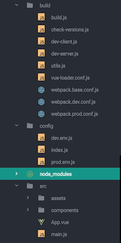
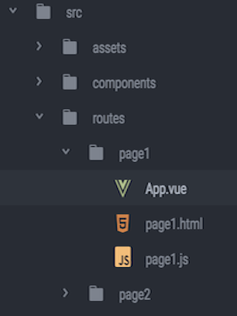

### Introduction

Recently I was looking for a simple boilerplate for vue-project and found it hard to get a really appropriate one. Functions like babel, autoprefixer, img processing are practically useful, while I just want a multi-page application without too much other instrusive library. So I try to transform one based on [vue-webpack-boilerplate](https://github.com/vuejs-templates/webpack#vue-webpack-boilerplate).   

### Getting started  

#### Init a project  
First, install vue-cli and init a new project with vue-webpack-boilerplate.  


```bash
$ npm install vue-cli -g  
$ vue init webpack [project-name]
$ cd [project-path]
$ npm install
```

 Most of work will be done under 'config/', 'build/' and 'src/'.  

#### Transform project structure  
Then transform structure of 'src/' to fit multi-page application.

Add a new folder named routes to contain pages. Then add two folder as pages called, for example 'page1' and 'page2'. Each page consist of three file: *[pageName].js*, *[pageName].html* and *App.vue*.  

***Why I organize it like this?***  
Since things like images are easier to process in *.vue* than *.html*, most of tradition coding(html, css, js) are moved to *App.vue*. Here *.html* is just only used as template and container for app, maybe you can edit meta/title either, *.js* is used to inject *App.vue* into *.html* and import main framework.  

<!-- more -->

```html
<!-- page1.html -->
<html>
  <head>
    <meta charset="utf-8">
    <title>custom</title>
  </head>
  <body>
    <div id="app"></div>
    <!-- built files will be auto injected -->
  </body>
</html>
```

```javascript
//page1.js:  
import Vue from 'vue'
import App from './App'

Vue.config.productionTip = false

new Vue({
  el: '#app',
  template: '<App/>',
  components: { App }
})
```

#### Configure entries
New a js file called entries under 'config/'. Traverse 'routes/' to get the name and entry(*[name].js*) of each page.  

```javascript
const fs = require('fs')
const path = require('path')

const ROUTES_PATH = path.resolve(__dirname,'../src/routes')
const routesArray = fs.readdirSync(ROUTES_PATH)

module.exports = {

}

routesArray.map(item=>(module.exports[item]=`@/routes/${item}/${item}.js`))
// console.log(module.exports)
// => { page1: '@/routes/page1/page1.js', page2: '@/routes/page2/page2.js' }
```

#### Modify config of webpack
Modify the entry of webpack in base config.

```javascript
//webpack.base.conf.js
...
var entries = require('../config/entries')
module.exports = {
  entry: entries,
  ...
}
...
```

Then modify options of HtmlWebpackPlugin for correct injection.

```javascript
//webpack.dev.conf.js
...
var entries = require('../config/entries')
var newHtmlPlugin = Object.keys(entries).map(key=>(
  new HtmlWebpackPlugin({
    filename: `${key}.html`,
    template: `src/routes/${key}/${key}.html`,
    inject: true,
    chunks: ['vendor', 'manifest', key]
  })
))

module.exports = {
  ...
  // new HtmlWebpackPlugin({
  //   filename: 'index.html',
  //   template: 'index.html',
  //   inject: true
  // }),
  ...
  plugins:[
    ...
  ].concat(newHtmlPlugin)
}
...
```

```javascript
//webpack.prod.conf.js
...
var entries = require('../config/entries')
var newHtmlPlugin = Object.keys(entries).map(key=>(
  new HtmlWebpackPlugin({
    filename: `${key}.html`,
    template: `src/routes/${key}/${key}.html`,
    inject: true,
    chunks: ['manifest', 'vendor', key],
    minify: {
      removeComments: true,
      collapseWhitespace: true,
      removeAttributeQuotes: true
      // more options:
      // https://github.com/kangax/html-minifier#options-quick-reference
    },
    // necessary to consistently work with multiple chunks via CommonsChunkPlugin
    chunksSortMode: 'dependency'
  })
))

module.exports = {
  ...
  // new HtmlWebpackPlugin({
  //   filename: config.build.index,
  //   template: 'index.html',
  //   inject: true,
  //   minify: {
  //     removeComments: true,
  //     collapseWhitespace: true,
  //     removeAttributeQuotes: true
  //     // more options:
  //     // https://github.com/kangax/html-minifier#options-quick-reference
  //   },
  //   // necessary to consistently work with multiple chunks via CommonsChunkPlugin
  //   chunksSortMode: 'dependency'
  // }),
  ...
  plugins:[
    ...
  ].concat(newHtmlPlugin)
}
...
```

***Some explanation:***
Option **'chunks'** in HtmlWebpackPlugin defaults to all entries in the *'entry'* option. So it should be modified to an array contains *'manifest'*, *'vendor'* and the entry of the exact page. **Remember to put 'manifest' and 'vendor' before the exact entry(manifest goes first). If you want to know more about vendor&manifest, please go for [CommonsChunkPlugin](http://webpack.github.io/docs/list-of-plugins.html#1-commons-chunk-for-entries)**

#### Run to test
Finally run 'npm run dev' to test. You can find your pages at *url*/[page-name].html


### More
I do some more work on this boilerplate and put it [@this repo](https://github.com/menthays/multi-page-boilerplate)
